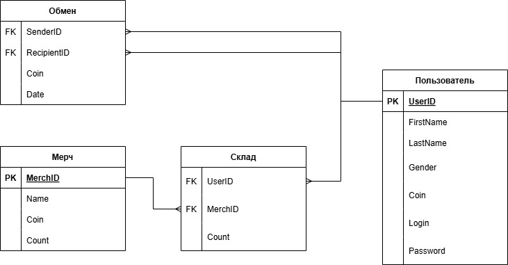
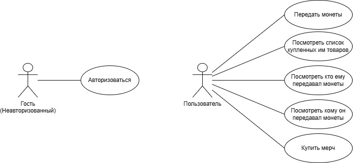

# Стек
Язык сервиса: Python. [(Библиотеки)](requirements.txt)

База данных: PostgreSQL.

Нагрузочной тестирование: ApacheBench
[(Тестирование)](StressTesting.MD)

# ER-диаграмма базы данных

В таблицу мерч я добавил поле *Count*, которое пока является заглушкой и не несет никакого смысла)

В таблицу обмен было добавлено поле *Date*, чтобы выводять пользователям информацию о времени совершения транзакции

# Use-Case

# Запуск
У меня не было возможности использовать Docker.

Для запуска из консоли:

**uvicorn main:app --host 0.0.0.0 --port 8080**

Перед эти необходимо подготовить базу данных, выполнив скрипты в папке **src/sql**, а именно:

***create_db.sql, create_type.sql, create_table.sql, add_constraint.sql***.

И теперь по адресу ***http://127.0.0.1:8080/docs*** можно увидеть FastAPI реализованного сервиса
